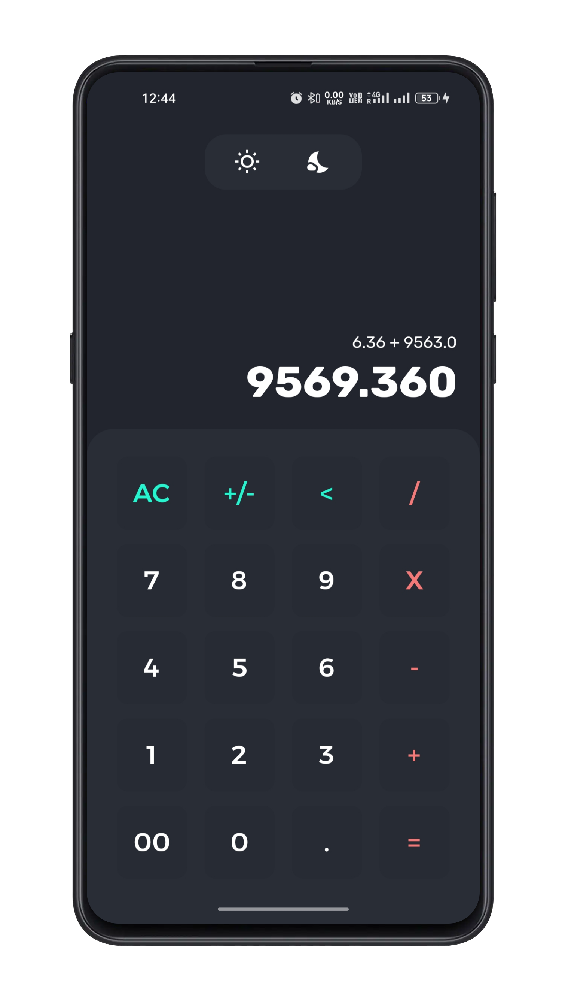
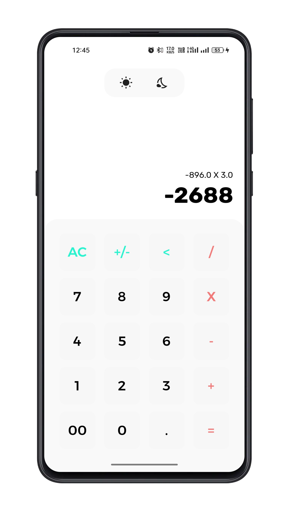

# **CoolCalc App**

Modern Responsive UI📱 of good old calculator 🔢 with Light 💡 and Dark 🖤 Theme support! 

## **Screnshots**

Some of screenshots showing the UI built using flutter

### **Dark Theme** 🖤

### **Light Theme** 💡

## **Features**

- Support decimal point numbers ⚫
- Responsive works on any device size ↗
- Works on both ios and android 📱
- Rounded number upto 3 decimal points 🔢
- Dark and Light theme toggle 🌗
- Handled Landscape mode like a pro 😎

## **Wanna Try?**

Head on to [Releases Page.](https://github.com/c0dysharma/CoolCalc/releases)
Choose based on your device [ABI](https://github.com/c0dysharma/CoolCalc/releases/tag/v.1.0.0-abi) or get [AIO file](https://github.com/c0dysharma/CoolCalc/releases/download/v.1.0.0/app-release.apk). ☮